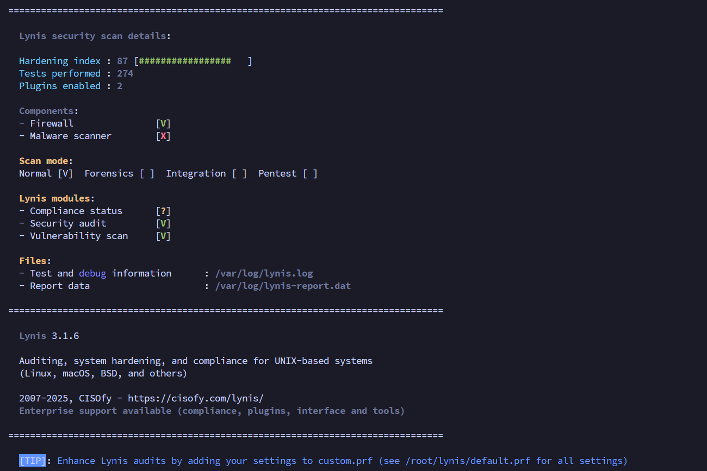

# 🔐 LinuxHardening with Ansible


A modular, Ansible-based Linux Hardening solution tailored for Debian-based systems. This project automates security configurations to comply with basic hardening best practices, making it ideal for academic, personal, and small-scale production environments.

---

## Features Based on dev-sec Roles

- 🛡️ **SSH Hardening**  
  - Disable root login (`PermitRootLogin without-password`)  
  - Disable password authentication (`PasswordAuthentication no`)  
  - Enforce public key authentication only (`PubkeyAuthentication yes`)  
  - Limit maximum authentication attempts (`MaxAuthTries 3`)  
  - Configure idle timeout (`ClientAliveInterval`, `ClientAliveCountMax`)

- 🔥 **Firewall Configuration**  
  - Implement default deny policies (`INPUT DROP`)  
  - Allow essential ports only (e.g., SSH, HTTP/HTTPS)  
  - Manage firewall rules via `iptables` or `ufw` modules  
  - Persist firewall rules across reboots

- 🧼 **Package Management**  
  - Remove insecure packages (e.g., Telnet, rsh)  
  - Install and configure intrusion prevention tools (e.g., `fail2ban`, `auditd`)  
  - Regularly update security patches

- 🔐 **Password and PAM Policies**  
  - Enforce password complexity via PAM modules (`pam_pwquality`)  
  - Set password expiration and account lockout policies  
  - Enable two-factor authentication options where possible  
  - Harden PAM config files to prevent brute force attacks

- 🪪 **File System Hardening**  
  - Set strict permissions on critical files (`/etc/passwd`, `/etc/shadow`, etc.)  
  - Mount `/tmp` with `noexec`, `nosuid`, `nodev` options  
  - Enable and configure SELinux/AppArmor if available  
  - Use AIDE for file integrity monitoring and alerting

- 🧾 **Logging & Auditing**  
  - Configure system logs with secure retention (`rsyslog` or `syslog-ng`)  
  - Enable kernel auditing with `auditd` and relevant audit rules  
  - Schedule regular integrity checks and generate reports  
  - Centralize logs to a remote syslog server for tamper-resistance

- 🧩 **Modular Role-Based Structure**  
  - Roles encapsulate discrete hardening domains (ssh, firewall, packages, etc.)  
  - Each role is idempotent and configurable via variables  
  - Easy to include/exclude roles per environment needs  
  - Clear separation of concerns for maintainability and scalability
  
---

## 📁 Project Structure

```
LinuxHardening/
├── ansible.cfg
├── inventory/
│   └── hosts.yml
├── roles/
│   ├── os_hardening/
│   └── ssh_hardening/
├── playbooks/
│   └──hardening.yml
├── requirements.txt
└── run_with_log.sh
```

---

## 🚀 Quick Start

### 1. Install Ansible on the Control Node

Make sure Ansible (v2.16+) is installed **only on your control node** (e.g., your local machine).  
You do **not** need to install Ansible on the target Debian systems.

```bash
sudo apt install -y software-properties-common
sudo add-apt-repository --yes --update ppa:ansible/ansible
sh -c 'apt-get update; apt-get upgrade -y; apt-get dist-upgrade -y; apt-get autoremove -y; apt-get autoclean -y'
sudo apt install -y ansible
ansible --version
```

### 2. Clone the repository

```bash
git clone https://github.com/hosseinzadeh-parsa/LinuxHardening.git
cd LinuxHardening
```

### 3. Customize Inventory & Variables

Edit `inventory/hosts.yml`, and optionally `group_vars/` or `host_vars/` as needed for your environment.

### 4. Test SSH Connectivity (Optional)

Before running the playbook, verify connectivity to the target hosts:

```bash
ansible all -i inventory/hosts.yml -m ping
```

If the response is `"pong"`, then SSH key-based access is working properly.

### 5. Run the Playbook

```bash
ansible-playbook playbooks/hardening.yml -i inventory/hosts.yml
```

> ⚠️ **Note:** All target systems must be accessible via **SSH key-based authentication** on **port 8090**, and the connecting user must have **sudo privileges**.

---

## 🧪 Testing and Debugging

### Dry Run (Check Mode)

To run the playbook without making any changes on the target hosts (dry run), use the `--check` option:

```bash
ansible-playbook playbooks/hardening.yml -i inventory/hosts.yml --check
```

### Debug Mode (Verbose)

To see more detailed output for debugging purposes, use the `-vvv` option:

```bash
ansible-playbook playbooks/hardening.yml -i inventory/hosts.yml -vvv
```

### Run with Log Output

To run the playbook and automatically save the full output (including errors) to a timestamped log file:

```bash
chmod +x run-with-log.sh
./run-with-log.sh
```
---

## ✅ Prerequisites

- Ansible version **2.16 or higher**
- Target systems must be **Debian-based** (Debian 11/12, Ubuntu 20.04/22.04/24.04)
- **SSH access** must be enabled on port **8090** using **public key authentication**
- **Sudo privileges** are required on all managed nodes

---

## 📋 Hardening Result: Lynis Security Audit

After applying this hardening playbook, the target Debian-based system was audited using [Lynis](https://cisofy.com/lynis).




> 🎉 **Final Hardening Score: 87/100**
>
> *Lynis reported a strong score of 87 with minimal warnings and no critical issues.*

---

## 📖 References

- **dev-sec/ansible-collection-hardening**  
  A modular and reusable set of Ansible roles for system hardening (CIS/STIG compliant)  
  GitHub: [https://github.com/dev-sec/ansible-collection-hardening](https://github.com/dev-sec/ansible-collection-hardening)

- **Lynis - Security Auditing Tool for Linux**  
  A powerful open-source auditing tool for Unix-based systems  
  Website: [https://cisofy.com/lynis](https://cisofy.com/lynis)  
  GitHub: [https://github.com/CISOfy/lynis](https://github.com/CISOfy/lynis)

- **Red Hat – Hardening Linux systems with Ansible**  
  An official Red Hat article on how to apply system hardening using Ansible automation  
  Link: [https://www.redhat.com/en/blog/ansible-linux-server-security](https://www.redhat.com/en/blog/ansible-linux-server-security)

---

## 👤 Author

**Parsa Hosseinzadeh**  
Linux Administrator & Security Enthusiast  
GitHub: [hosseinzadeh-parsa](https://github.com/hosseinzadeh-parsa)